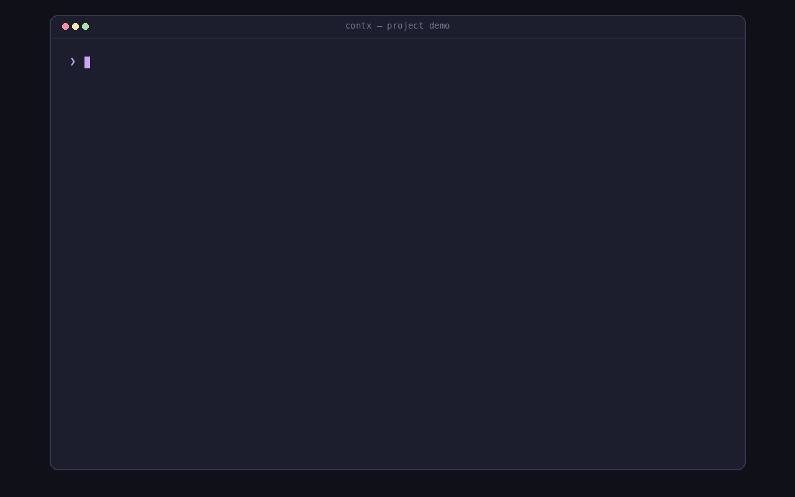

<p align="center">
  
</p>

<h1 align="center">contx</h1>

<p align="center">
  <strong>Find a project, open it in tmux or Herdr.</strong>
</p>

<p align="center">
  <a href="https://github.com/vieitesss/contx/releases/latest"></a>
</p>

<p align="center">
  <a href="#features">Features</a> ·
  <a href="#install">Install</a> ·
  <a href="#usage">Usage</a> ·
  <a href="#configuration">Configuration</a> ·
  <a href="SKILL.md">Agent workflows</a>
</p>

<p align="center">
  
</p>

contx is a Rust terminal picker and CLI for project directories. It finds
configured projects, shows Git context, and opens a selected directory as a
tmux session or Herdr workspace.

## Features

<table>
  <tr>
    <td width="33%" valign="top">
      <h4>🔎 Project picker</h4>
      Fuzzy-search grouped project directories with branch and working-tree context.
    </td>
    <td width="33%" valign="top">
      <h4>🪟 tmux and Herdr</h4>
      Activate a project as a tmux session or Herdr workspace.
    </td>
    <td width="33%" valign="top">
      <h4>🧰 Project actions</h4>
      Clone repositories, create directories, and delete candidates; the CLI also
      creates Git worktrees.
    </td>
  </tr>
</table>

Discovery is multiplexer-independent. Activation uses one backend at a time;
contx does not manage panes, tabs, or agent processes.

## Install

Requires Rust and Cargo. Install the latest source with:

```sh
cargo install --git https://github.com/vieitesss/contx
```

Project activation requires a live tmux or Herdr context.

## Usage

```sh
contx                              # Open the project picker
contx list                         # List discovered candidates
contx open /path/to/project        # Activate a candidate
contx --json list                  # List candidates as JSON
```

With no subcommand, `contx` opens the picker. `open` only accepts a current
candidate. Use `--multiplexer tmux` or `--multiplexer herdr` to choose the
backend explicitly; `auto` detects the current multiplexer context. Run
`contx --help` for all commands and options.

## Configuration

The default configuration file is `~/.config/contx/config.toml`. Add parent
directories to `paths`; `git-from-home = true` also discovers Git repositories
in the immediate child directories of your home directory. A missing default
config means there are no candidates. See [`config.toml`](config.toml) for an example.

For agent workflows, including structured CLI usage, see [SKILL.md](SKILL.md).
